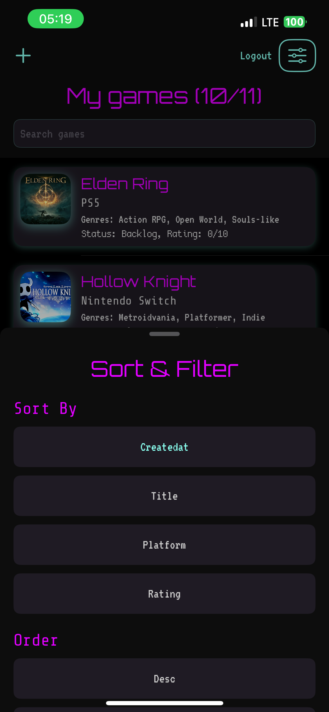

# GameBacklogApp

iOS app for managing a game backlog with offline support

## Features

- Add, edit, delete games with title, platform, cover URL, status, rating, notes, genres
- Fuzzy search using Levenshtein distance
- Sorting and filtering by title, platform, rating, status
- Offline support via Core Data with sync on reconnect
- Neo-Retro design with custom fonts and color themes
- MVVM architecture

## Screenshots

### Login

### Game List

### Fuzzy Search

### Game Detail

### Edit Game

### Sorting and Filtering

### Offline Mode

### UML diagram

## Requirements

- Xcode 15+
- iOS 17+
- Swift 5.9+
- Vapor backend (local or deployed)

## Launch

1. Clone repository
2. Open in Xcode
3. Run on simulator or device
4. Ensure backend server is running and accessible